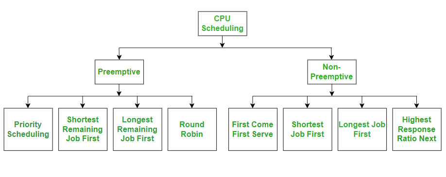

### CPU Scheduling

- CPU scheduling is the process of selecting which process or thread will execute next on the CPU.
- It is essential for efficient multitasking and resource utilization in operating systems.



***Key Goals of CPU Scheduling:***
1. Maximize CPU Utilization (Keep CPU as busy as possible).
2. Maximize Throughput (Increase the number of completed processes).
3. Minimize Waiting Time (Reduce time spent in the ready queue).
4. Minimize Response Time (Time taken for a process to start execution).
5. Ensure Fairness (No starvation of low-priority processes).

***Why is CPU Scheduling Needed?***
- A modern computer executes multiple processes at once (multitasking).
- Since a single-core CPU can run only one process at a time, the OS must schedule which process runs and when.
- Without scheduling, some processes may starve, and system efficiency would be low.

***Example Without CPU Scheduling***
- Imagine 5 people (processes) standing in line for a single cashier (CPU).
- Without scheduling, some people may never get their turn, causing delays and inefficiency.

***Types of CPU Scheduling***
- ***Preemptive:*** CPU can be taken from a process and assigned to another (e.g., Round Robin).
- ***Non-Preemptive:*** Once a process starts execution, it runs until completion (e.g., FCFS).

***Preemptive***
- Preemptive Scheduling is a CPU scheduling technique where the CPU can switch from one process to another before the current process completes execution.
- This ensures better CPU utilization, responsiveness, and multitasking.

***Why is Preemptive Scheduling Needed?***
- ***Improves CPU Utilization*** : Ensures the CPU is always busy by switching to another process if a high-priority process arrives.
- ***Allows Multitasking*** : Essential for time-sharing systems like Windows, Linux, and macOS.
- ***Ensures Fairness*** : Prevents a single long process from monopolizing CPU time.
- ***Handles Real-Time Processes*** : Used in real-time operating systems where certain tasks must be executed immediately.

***Key Features of Preemptive Scheduling***
1. Process Interruption: A running process can be interrupted and moved to the ready queue.
2. Time Quantum: In Round Robin scheduling, each process gets a fixed time slice (quantum).
3. Dynamic Process Prioritization: A new process with a higher priority can preempt a lower-priority process.
4. Better Responsiveness: Reduces response time for interactive applications.
5. Complex Implementation: Requires context switching, making it more complex than non-preemptive scheduling.

***How Preemptive Scheduling Works?***

- Example Scenario :
  - P1 starts execution (CPU burst: 10ms).
  - P2 arrives after 2ms with a shorter CPU burst (5ms).
  - CPU switches from P1 to P2.
  - After P2 completes, P1 resumes execution.

***Preemptive Scheduling Algorithms with Examples***

***1. Round Robin (RR)***
- Each process gets a fixed time quantum (e.g., 4ms).
- If not completed, it moves to the end of the queue.
- Ensures fair allocation of CPU time.

***Example (Time Quantum = 4ms)***

- ***TODO***

***2. Shortest Remaining Time First (SRTF)***
- Preemptive version of Shortest Job First (SJF).
- If a new process with a shorter burst time arrives, CPU switches to it.
- Minimizes average waiting time.

***Example***

- ***TODO***

***3. Preemptive Priority Scheduling***
- Processes are assigned priorities (lower number = higher priority).
- A higher-priority process preempts a lower-priority one.
- Starvation can occur (solved using aging).

***Example***

- ***TODO***

***Non-Preemptive***
- Non-Preemptive Scheduling is a CPU scheduling technique where a process, once given the CPU, runs until completion or until it voluntarily releases the CPU.

***Key Characteristics:***
- No process interruption: The CPU cannot be taken away from a running process.

- Simple and easy to implement: No complex context switching.

- Less overhead: No need for preemption-related mechanisms.

- Not suitable for interactive systems: Long-running processes may delay others.

***Why is Non-Preemptive Scheduling Used?***
- Suitable for batch processing systems where user interaction is minimal.

- Ensures predictable execution as processes complete sequentially.

- Less CPU overhead since context switching occurs only at process termination.

***Types of Non-Preemptive Scheduling Algorithms***
 1. First Come First Serve (FCFS)
    - The simplest scheduling algorithm.
    - Processes are executed in the order of arrival.
    - Disadvantage: Can cause convoy effect (longer processes delay shorter ones).

- ***TODO***

 2. Shortest Job Next (SJN) / Shortest Job First (SJF)
   - Process with the shortest burst time executes first.
   - Minimizes average waiting time.
   - Disadvantage: Requires prior knowledge of burst times.

- ***TODO***

 3. Priority Scheduling (Non-Preemptive)
   - Processes execute based on assigned priority.
   - Lower number = Higher priority.
   - Disadvantage: May cause starvation (low-priority processes may wait indefinitely).

- ***TODO***


***Key Concepts in CPU Scheduling***

### context switching.

- ***TODO***
- 
```Process States```
  - ***New:*** Process is being created.
  - ***Ready:*** Process is waiting in the queue for execution.
  - ***Running:*** Process is currently executing on the CPU.
  - ***Waiting*** Process is waiting for I/O operation.
  - ***Terminated:*** Process has finished execution.

```Scheduling Criteria```
  - ***CPU Utilization:*** Keep the CPU as busy as possible.
  - ***Throughput :***  Number of processes completed per unit time.
  - ***Turnaround Time :*** Total time taken by a process to complete.
  - ***Waiting Time :*** Time a process spends waiting in the ready queue.
  - ***Response Time :*** Time taken to start executing after submission.

