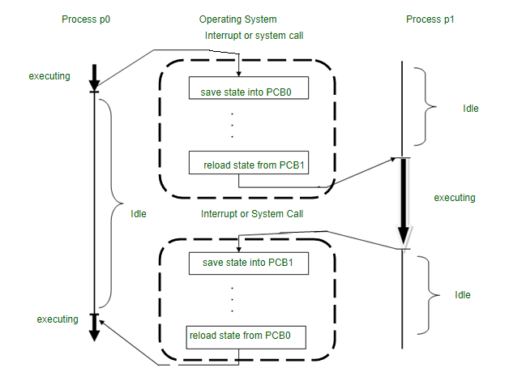

### What is a Core in a Processor?

- A core in a processor is an independent processing unit within the CPU that can execute instructions.
-  Modern processors have multiple cores, which allow them to perform multiple tasks simultaneously, improving performance and efficiency.

- ***TODO***

### What is a Process?

- A process is an instance of a program that is being executed by the CPU. It contains:
    - ***Program Code (Text Section)*** – Instructions of the program.
    - ***Data Section*** - Global variables.
    - ***Heap*** - Dynamically allocated memory.
    - ***Stack*** - Function calls and local variables.
    - ***Process Control Block (PCB)*** -  Information like process ID, registers, and scheduling details.

  ***What is Multiprocessing?***

    - Multiprocessing is the ability of a system to run multiple processes simultaneously using multiple CPUs (cores).
    -  It improves efficiency by utilizing all available processing units.

  ***Types of Multiprocessing***

    1) Symmetric Multiprocessing (SMP)
        - All CPUs share memory and the OS treats them equally.
        - Example: Modern multi-core processors (Intel i7, Ryzen 9).

    2) Asymmetric Multiprocessing (AMP)
        - One CPU is the master, others execute assigned tasks.
        - Example: Embedded systems (e.g., microcontrollers).

***Pros**

- ***Faster Execution*** Multiple processes run in parallel, reducing execution time.
- ***Better Resource Utilization*** CPU cores are used efficiently.
- ***Fault Tolerance*** If one CPU fails, others can continue execution.
- ***Supports Multitasking*** Multiple tasks can be performed simultaneously.

***Cons***

- ***Increased Complexity*** Managing multiple processes and synchronization is difficult.
- ***Higher Power Consumption*** More CPUs consume more power.
- ***More Expensive*** Requires additional hardware (multi-core CPUs).
- ***Synchronization Issues*** Processes may need to share resources (e.g., memory), leading to race conditions.

- ***TODO***


### Address Space and Memory Space of a Process

- When a program is executed, it is loaded into memory (RAM) as a process.
- The operating system assigns it a unique address space and manages its memory space.

1. Address Space of a Process

- The address space is the range of memory addresses assigned to a process by the OS.
-  It defines where the process can read, write, and execute data.

***Types of Address Spaces***

1. Logical (Virtual) Address Space
    - Created by the OS and CPU for each process.
    - Does not refer to actual physical memory.
    - Uses paging or segmentation to map to physical memory.
    - enerated by the CPU and used by the program.
2. Physical Address Space
    - The actual memory location in RAM where the process is stored.
    - Managed by the OS via MMU (Memory Management Unit).
    - The MMU translates logical addresses → physical addresses.


2. Memory Space of a Process
- The memory space of a process is divided into different sections:

***Memory Layout of a Process in RAM***

- Text Segment : Stores compiled program instructions (code).
- Data Segment : Stores global and static variables.
- Heap         : Stores dynamically allocated memory (malloc, new). Grows upwards.
- Stack        : Stores function calls, local variables, and return addresses. Grows downwards.

### Process Communication

- When multiple processes run in an operating system,they often need to exchange data or coordinate execution.
- This is done through Inter-Process Communication (IPC).

***Why is IPC Needed?***
1. ***Sharing Data*** - Two or more processes need to share information (e.g., browser and download manager).
2. ***Synchronization*** -  Ensuring one process waits for another (e.g., producer-consumer problem).
3. ***Event Notification*** - Notifying processes about system events (e.g., signals in Linux).
4. ***Resource Sharing*** - Avoiding race conditions when multiple processes use shared resources.
5. ***Process Coordination*** - Ensuring proper execution order between dependent processes.

- ***TODO***

### Process Switching

- Process switching, also known as ```context switching```, occurs when the operating system (OS) switches from executing one process to another.
- This happens when:
    - A process finishes execution.
    - A process gets blocked (waiting for I/O, resources, etc.).
    - The OS preempts a process due to time-sharing (CPU scheduling).

- During a process switch, the CPU saves the current process state and loads the state of the next process.

***Context Switching Triggers***
- The three different categories of context-switching triggers are as follows.
  1. ***Interrupts :*** Interrupts: When a CPU requests that data be read from a disc 
     if any interruptions occur, context switching automatically switches to a component of the hardware .
     that can handle the interruptions more quickly.

  2. ***Multitasking :*** The ability for a process to be switched from the CPU so that another process can run is known as context switching. 
     When a process is switched, the previous state is retained so that the process can continue running at the same spot in the system.

  3. ***User/Kernel switch :*** This trigger is used when the OS needed to switch between the user mode and kernel mode.
     When switching between user mode and kernel/user mode is necessary, operating systems use the kernel/user switch.

***Steps in Process Switching***
1. Save the current process state (registers, program counter, stack pointer).
2. Move the current process to a ready/waiting queue.
3. Select the next process from the ready queue (CPU scheduling).
4. Load the next process's state into the CPU.
5. Resume execution from where the next process left off.

***Why is Process Switching Costly?***
- Process switching has a performance overhead because:
    1. Saving and restoring registers takes CPU cycles.
    2. Flushing and reloading memory caches slow down execution.
    3. Switching between different address spaces requires updating page tables and TLB (Translation Lookaside Buffer).
    4. Kernel mode to user mode transition adds latency.

***Example:***
- If a CPU switches processes frequently (high context switch rate), system performance drops due to excessive time spent saving/loading states.

- ***TODO*** 

### What is Process Control Block(PCB)? 
- So, The Process Control block(PCB) is also known as a Task Control Block. 
- it represents a process in the Operating System. 
- A process control block (PCB) is a data structure used by a computer to store all information about a process. 
- It is also called the descriptive process. When a process is created (started or installed), the operating system creates a process manager.

***State Diagram of Context Switching***


***Working Process Context Switching***
- So the context switching of two processes, the priority-based process occurs in the ready queue of the process control block.
- These are the following steps.
   - The state of the current process must be saved for rescheduling.
   - The process state contains records, credentials, and operating system-specific information stored on the PCB or switch.
   - The PCB can be stored in a single layer in kernel memory or in a custom OS file.
   - A handle has been added to the PCB to have the system ready to run.
   - The operating system aborts the execution of the current process and selects a process from the waiting list by tuning its PCB.
   - Load the PCB’s program counter and continue execution in the selected process.
   - Process/thread values ​​can affect which processes are selected from the queue, this can be important.